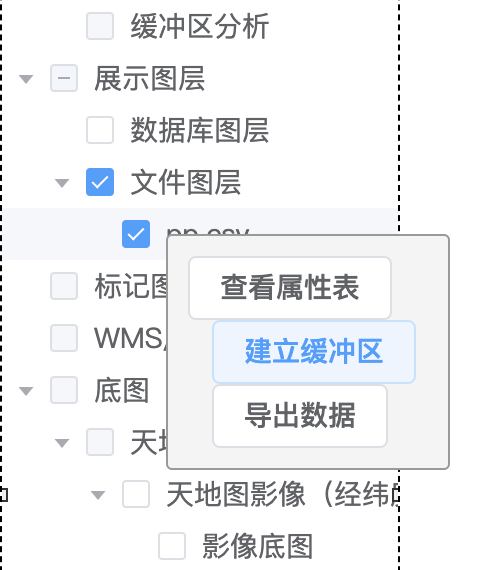
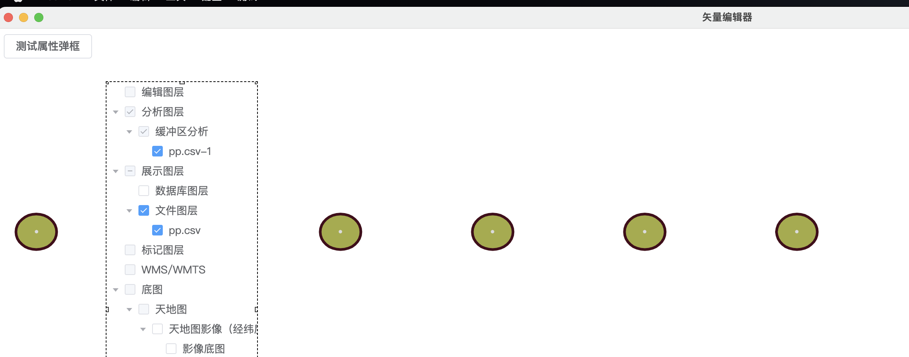

# 缓冲区分析

## 功能诉求

1、基于点要素的缓冲区，通常以点为圆心、以一定距离为半径的圆。
2、基于线要素的缓冲区，通常是以线为中心轴线，距中心轴线一定距离的平行条带多边形。
3、基于面要素多边形边界的缓冲区，向外或向内扩展一定距离以生成新的多边形。

## 操作说明
前提: 展示图层 -> 文件图层 下有节点（导入过csv文件或者shp文件）
在图层树的 展示图层 -> 文件图层 下右键

点击后界面如图所示

点击确定按钮完成缓冲区生产。最终效果如图所示

