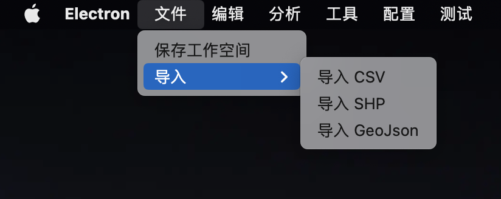
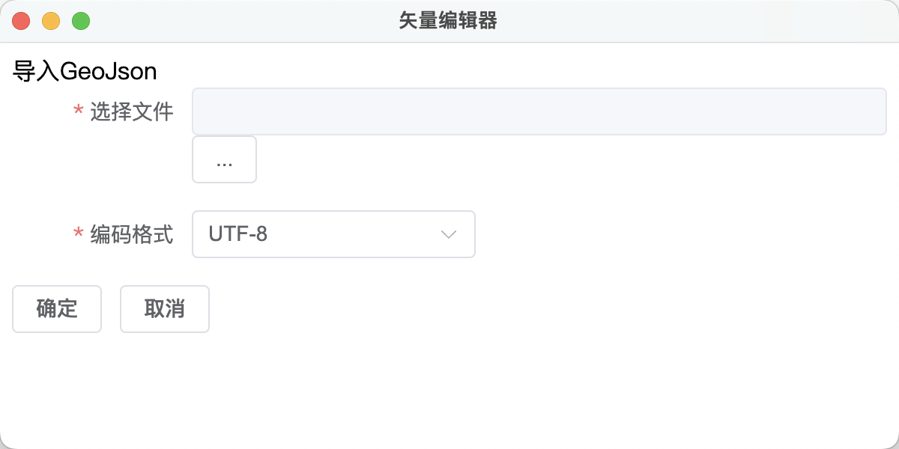
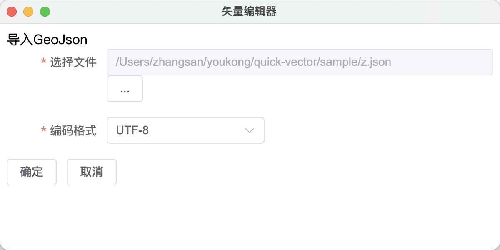
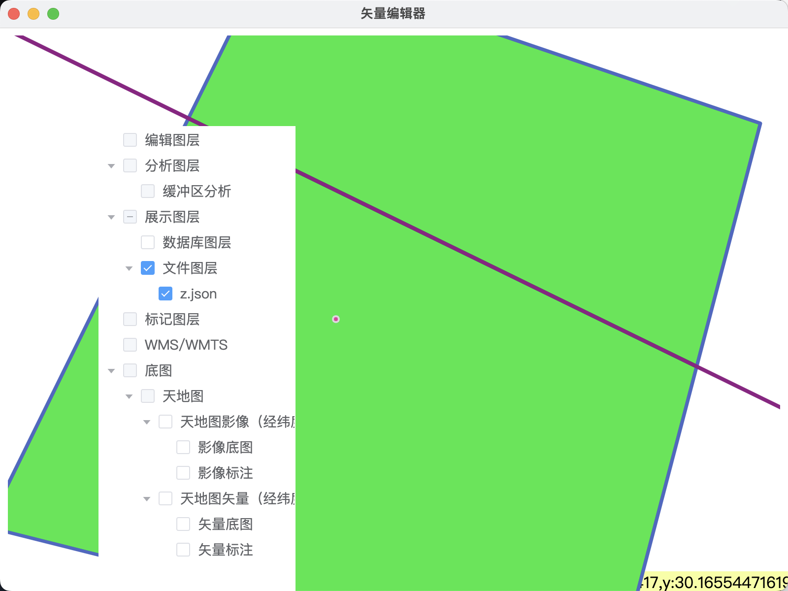

# GeoJson 成图

## 需求说明
根据提供的GeoJson文件将数据在地图上展示

## 操作说明

入口: 依次点击本软件菜单 文件 -> 导入 -> 导入 GeoJson。入口界面如图所示

点击后界面如图所示

准备一份GeoJson数据，本例数据: [测试GeoJson](../../sample/z.json)

将测试数据下载后点击选择文件的`...`按钮，选择后具体配置信息如图所示

点击确定按钮进行成图，成图后主窗口界面如图所示

