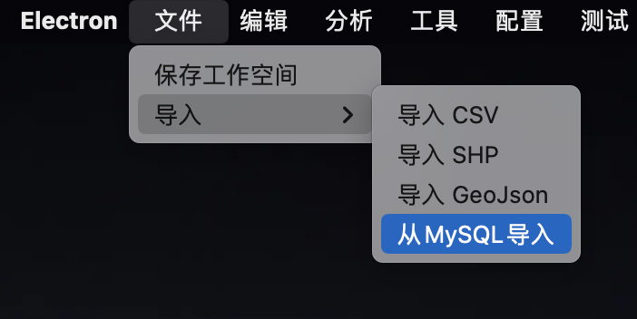
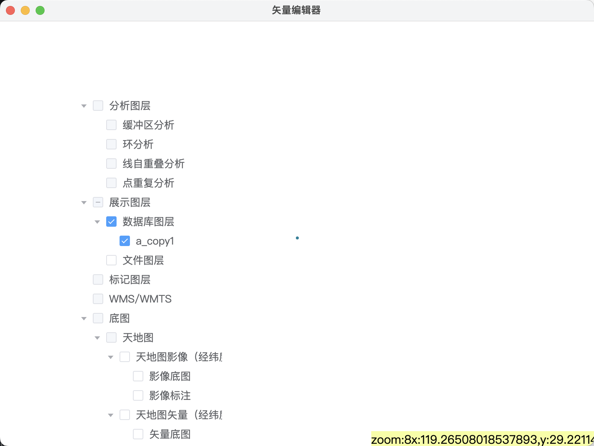

# Mysql 成图

## 需求说明
链接到MySQL数据库选择指定的表进行成图。

## 带有空间数据成图

带有空间数据是指表中存在`geometry`类型的数据字段。

>   前置操作：创建数据库，
>
>   创建数据表：
>
>   ```
>   CREATE TABLE `a_copy1` (
>     `id` varchar(255) CHARACTER SET utf8mb4 COLLATE utf8mb4_0900_ai_ci DEFAULT NULL,
>     `geometry` geometry DEFAULT NULL
>   ) ENGINE=InnoDB DEFAULT CHARSET=utf8mb4 COLLATE=utf8mb4_0900_ai_ci;
>   ```
>
>   在上述数据中`geometry`是空间数据
>
>   插入数据：
>
>   ```
>   INSERT INTO `a`.`a_copy1` (`id`, `geometry`) VALUES ('1', ST_GeomFromText('MULTILINESTRING((119.456968320495 29.2185869231014, 119.457030454832 29.2181936331143))'));
>   INSERT INTO `a`.`a_copy1` (`id`, `geometry`) VALUES ('2', ST_GeomFromText('MULTILINESTRING((119.456968320495 29.2185869231014, 119.457030454832 29.2181936331143))'));
>   INSERT INTO `a`.`a_copy1` (`id`, `geometry`) VALUES ('3', ST_GeomFromText('MULTILINESTRING((119.457030454832 29.2181936331143, 119.456968320495 29.2185869231014))'));
>   ```
>
>   


入口: 依次点击本软件菜单 文件 -> 导入 -> 从MySQL导入。入口界面如图所示




点击后界面弹框如图所示


在上述界面中依次填入相关内容后，点击**获取数据信息**按钮，点击后界面如图所示


选择数据库后界面如图所示


选择表后界面如图所示


选择完成空间字段后点击**获取geojson**按钮完成成图，此时主界面如图所示


