# CSV 成图

## 需求说明
根据提供的点表或者线表进行数据成图。注意点表和线表中可能没有坐标数据需要外联表。

## 操作说明
入口: 依次点击本软件菜单 文件 -> 导入 -> 导入csv。入口界面如图所示

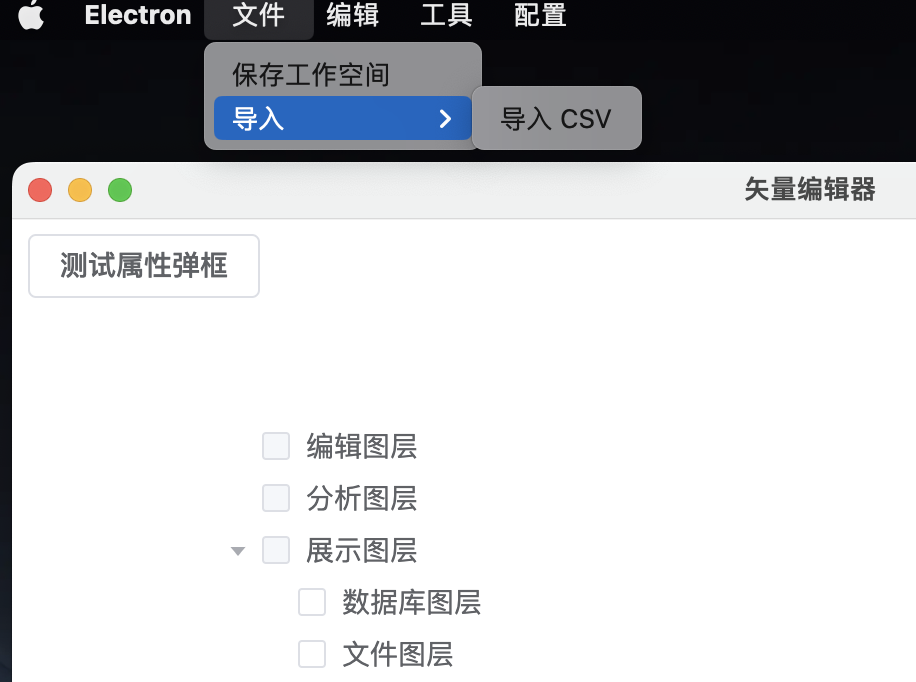

点击后界面如图所示

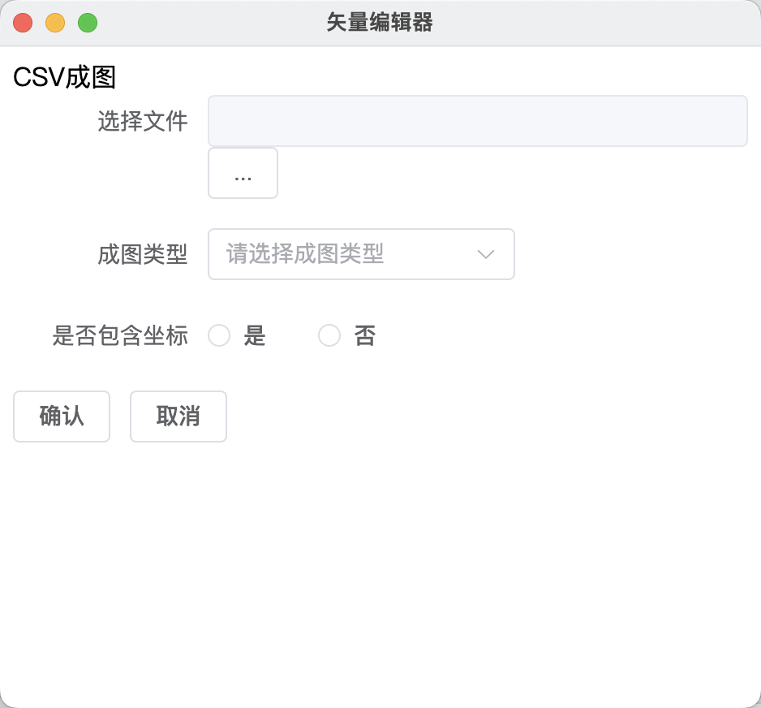


### 点表成图(带坐标数据)

-   准备一个CSV文件，采用UTF8编码存储。文件内容如下

```csv
name,x,y
张三1,119.45436769887343,29.2080525919085
张三2,119.45446769887343,29.2080525919085
张三3,119.45456769887343,29.2080525919085
张三4,119.45466769887343,29.2080525919085
张三5,119.45476769887343,29.2080525919085
张三6,119.45486769887343,29.2080525919085

```

将上述文本存储到本地文件中，通过下图中的按钮选择文件

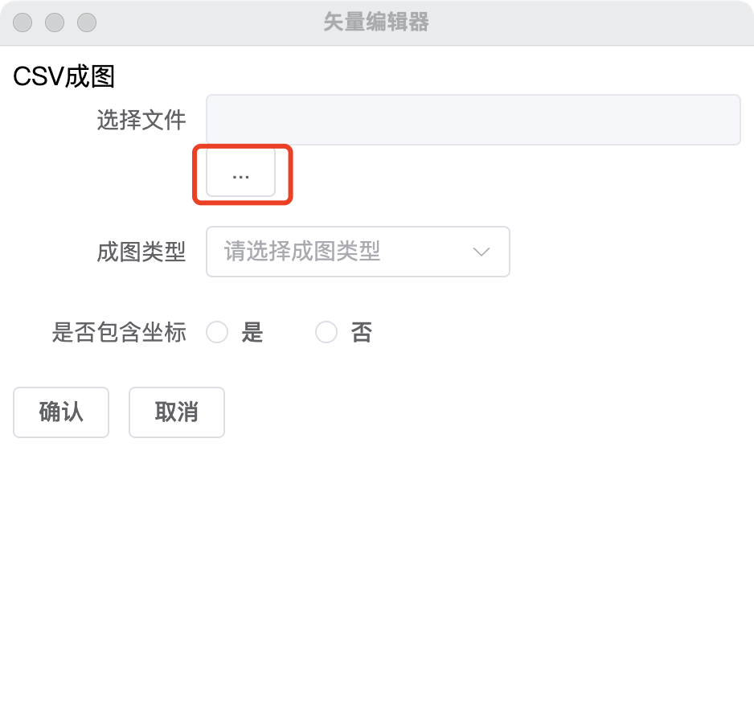


选中后根据下图内容进行配置

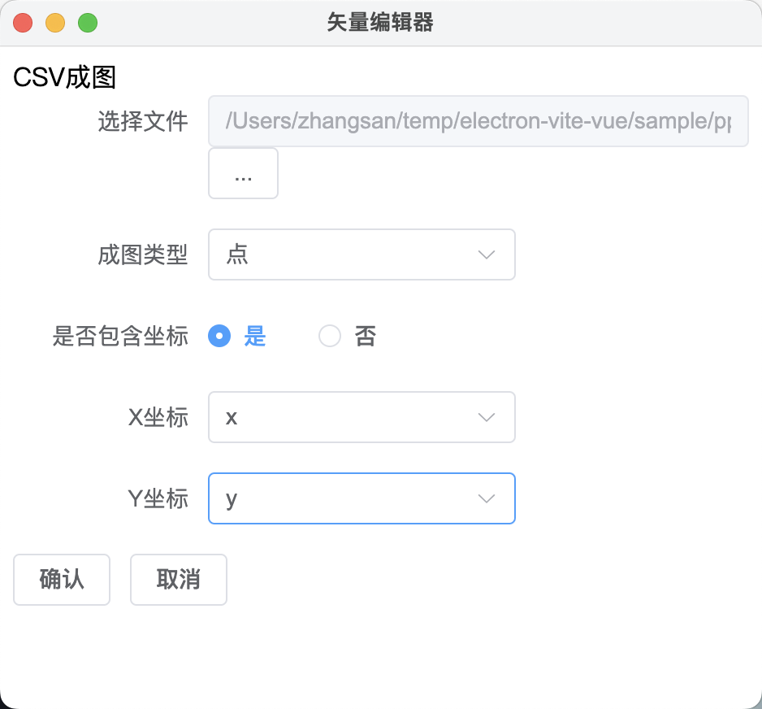

配置完成后点击确认按钮，点击后CSV成图界面将会关闭。关闭后主界面会在文件图层下增加一个文件名为pp.csv的节点。`pp.csv`标识的是文件名


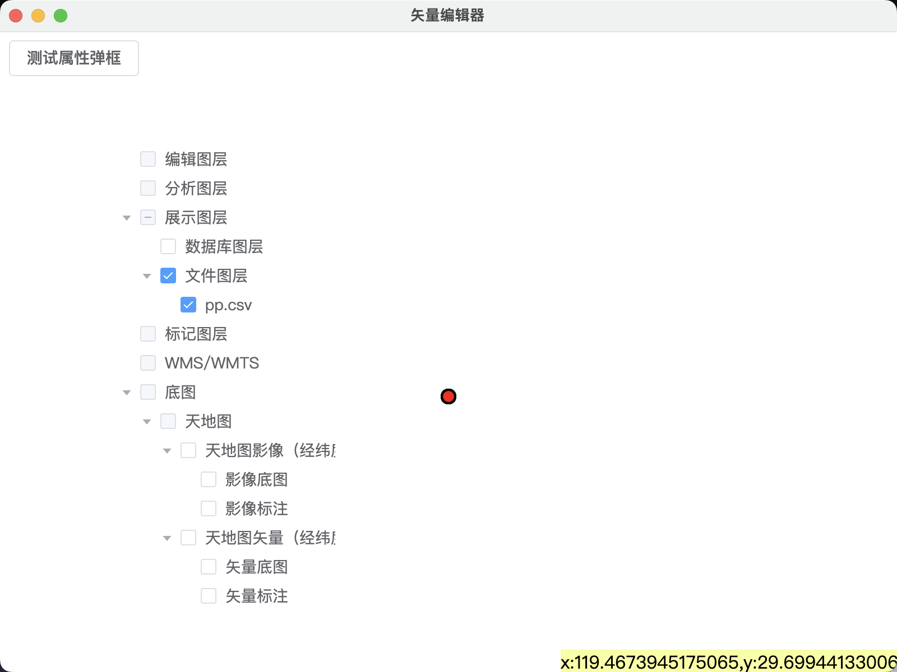

Tips: 由于地图缩放比例需要用户自行缩放到可见范围。

### 点表成图(无坐标数据)

-   准备一个CSV文件，采用UTF8编码存储。文件内容如下

```csv
name,age
张三,10
李四,10

```

将上述文本存储到本地文件中，通过下图中的按钮选择文件


由于本例中csv文件中不包含坐标数据因此需要按照下图进行选择

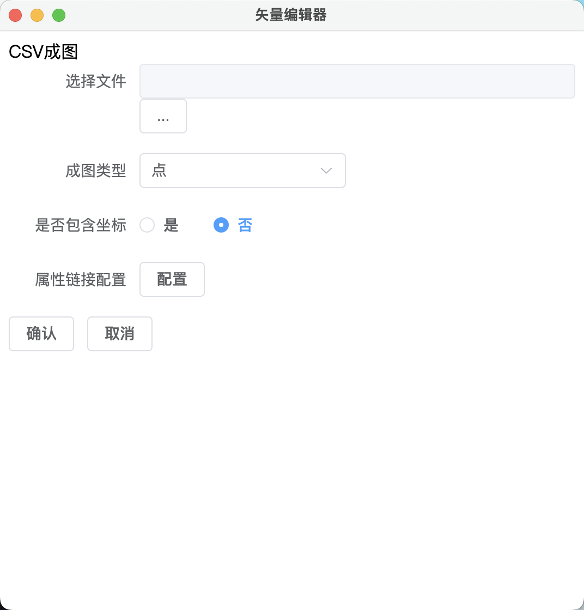

选择完成后点击配置按钮，弹出界面如图所示

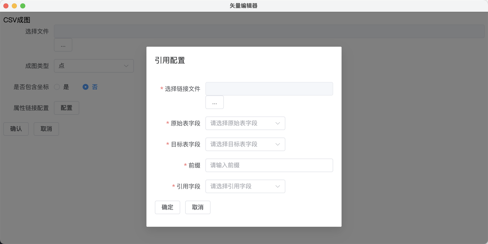


在上图中的点击`...`按钮选择链接文件。链接文件需要满足如下要求：

1.   文件类型是csv
2.   文件中有坐标数据
3.   文件中有一列和成图文件中的一列有关联。

本例中链接文件如下

```
n1,x,y
张三,119.45436769887343,29.2180525919085
李四,119.45436769887343,29.2280525919085

```

本例配置截图如下

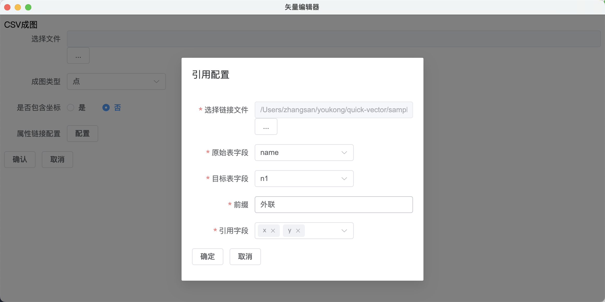


配置完成后点击确定，回到CSV成图界面进行配置，具体配置内容如图所示


点击确认即可看到成图

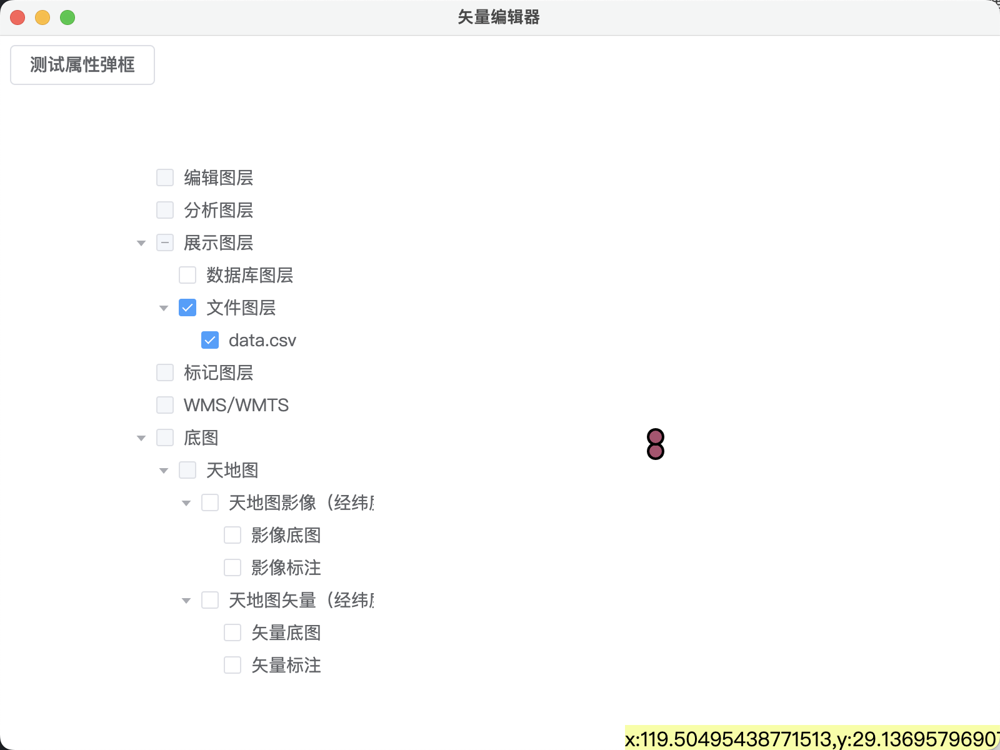


### 线表成图(带坐标数据)

准备一个CSV文件，采用UTF8编码存储。文件内容如下

```csv
name,age,sx,sy,zx,zy
张三,10,119.45436769887343,29.2080525919085,119.45436969887343,29.2280525919085

```

将上述文本存储到本地文件中，通过下图中的按钮选择文件


具体配置信息如图所示


点击确认后主窗口界面如图所示


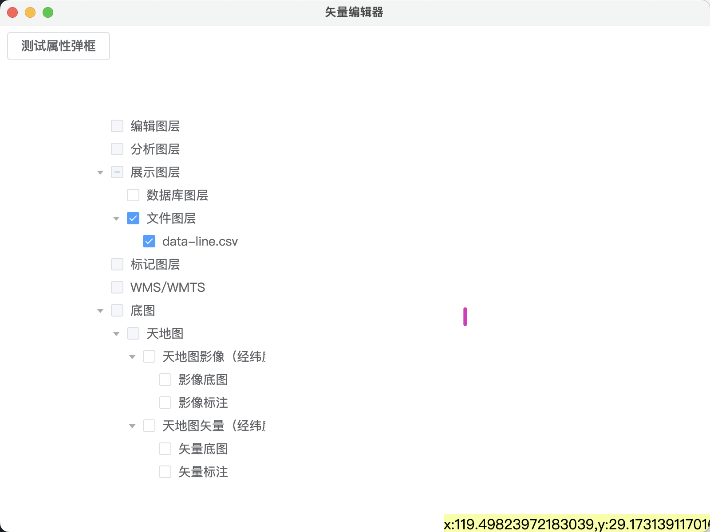

### 线表成图(无坐标数据)

准备一个CSV文件，采用UTF8编码存储。文件内容如下

```csv
name,age
张三,10
```

将上述文本存储到本地文件中，通过下图中的按钮选择文件


由于本例中csv文件中不包含坐标数据因此需要按照下图进行选择


选择完成后点击配置按钮，弹出界面如图所示


在上图中的点击`...`按钮选择链接文件。链接文件需要满足如下要求：

1.   文件类型是csv
2.   文件中有坐标数据
3.   文件中有一列和成图文件中的一列有关联。

本例中链接文件如下

```
name,sx,sy,zx,zy
张三,119.45436769887343,29.2080525919085,119.45436969887343,29.2280525919085

```

本例配置截图如下

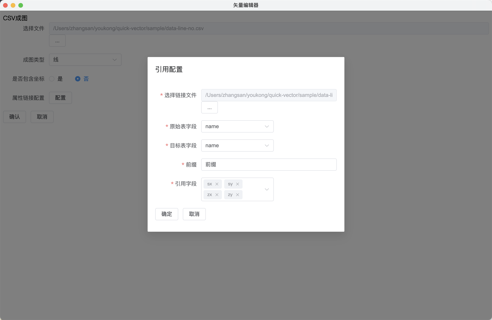


配置完成后点击确定，回到CSV成图界面进行配置，具体配置内容如图所示


点击确认即可看到成图

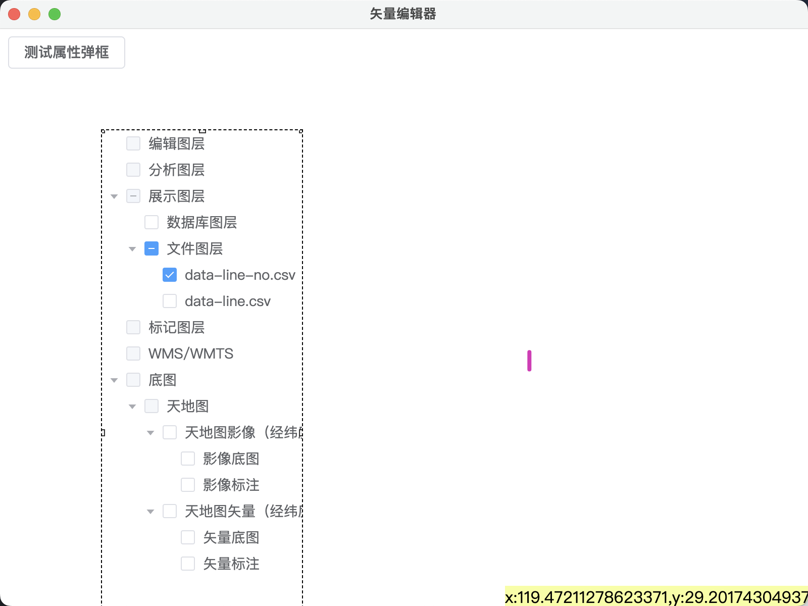

## 实现原理

